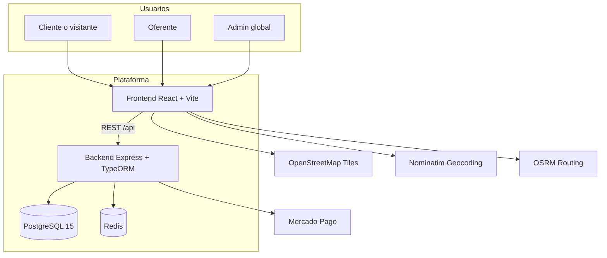

# Arquitectura General

## Resumen
Match Coffee es una arquitectura web clasica de tres capas con frontend SPA, backend API y base de datos relacional. Se despliega con Docker Compose e integra servicios externos para mapas y suscripciones.

## Componentes principales
- Frontend: React 18 + Vite, UI basada en componentes y consumo de API REST.
- Backend: Node.js + Express + TypeORM, con RLS multi-tenant en PostgreSQL.
- Base de datos: PostgreSQL 15 con politicas de Row Level Security y triggers de consistencia.
- Cache: Redis configurado para extensiones futuras.
- Infra: Nginx como servidor del frontend y reverse proxy hacia el backend.

## Diagrama de contexto

## Flujo de datos principal
1. El frontend autentica usuarios y consume la API bajo `/api`.
2. El backend valida JWT, resuelve el tenant y ejecuta consultas con RLS.
3. PostgreSQL aplica politicas de aislamiento por `tenant_id`.
4. El frontend renderiza feed, publicaciones, reservas y paneles de gestion.

## Multi-tenant y seguridad
- El aislamiento no usa esquemas separados; se realiza con RLS y `tenant_id`.
- `runWithContext` configura `app.tenant_id` y `app.is_admin_global` por transaccion.
- El admin global puede operar sin restriccion de tenant.

## Integraciones externas
- Mercado Pago: validacion de suscripciones para publicidad y reservas.
- OpenStreetMap: mapas y tiles.
- Nominatim: geocodificacion de direcciones.
- OSRM: calculo de rutas y distancias.

## Consideraciones tecnicas
- Las imagenes pueden almacenarse como data URLs en la base de datos.
- No hay sistema de migraciones automaticas; el modelo se carga desde `db/init.sql`.
- Redis esta disponible pero aun no se utiliza en el backend.
