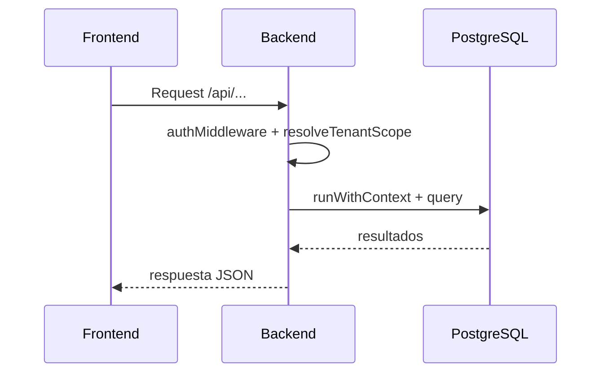

# Backend

## Resumen
El backend es una API REST en Node.js con Express y TypeORM. Maneja autenticacion con JWT, roles de usuario, moderacion de publicaciones, reservas de mesas y suscripciones para publicidad y reservas. El aislamiento multi-tenant se implementa con Row Level Security (RLS) en PostgreSQL usando `tenant_id`.

## Stack y dependencias
- Node.js 18+ (usa `fetch` nativo en servidor).
- Express 4.18 + TypeORM 0.3.
- PostgreSQL 15 con RLS.
- Redis configurado para futuras mejoras.
- `sharp` para compresion de imagenes base64.

## Estructura relevante
- `backend/src/server.ts`: bootstrap, CORS y montaje de rutas.
- `backend/src/routes.ts`: definicion de endpoints y logica principal.
- `backend/src/entities/`: entidades TypeORM (usuarios, negocios, publicaciones, reservas, planes).
- `backend/src/middleware/auth.ts`: autenticacion JWT y control de roles.
- `backend/src/utils/rls.ts`: helper para setear contexto RLS por transaccion.
- `backend/src/config/data-source.ts`: configuracion de TypeORM.

## Flujo de peticion
1. Express recibe la request y valida JSON.
2. `authMiddleware` valida JWT y determina rol.
3. `resolveTenantScope` determina el `tenantId` via JWT, `x-tenant-id` o query `tenantId`.
4. `runWithContext` setea GUCs RLS (`app.tenant_id`, `app.is_admin_global`).
5. TypeORM ejecuta la consulta bajo RLS.

## Diagrama de peticion

## Multi-tenant con RLS
- Todas las tablas relevantes contienen `tenant_id`.
- El contexto se controla con `SET LOCAL app.tenant_id` y `app.is_admin_global`.
- Las politicas se definen en `db/init.sql` y restringen acceso por tenant.

## Como enviar el tenantId
- Header: `x-tenant-id: <id>`
- Query param: `?tenantId=<id>`
- JWT: si el usuario ya tiene tenant asignado, se usa ese valor.
- Admin global puede omitir `tenantId` para ver todo.

## Roles y permisos
- Admin global: valida oferentes, modera publicaciones, gestiona publicidad.
- Oferente: administra negocios, publicaciones, mesas y reservas.
- Cliente o visitante: explora feed, comenta, califica y reserva.

## Creacion automatica de tenant
- Si un oferente sin tenant crea un negocio, el backend crea un tenant activo y lo asigna al usuario.

## Manejo de imagenes
- Se aceptan URLs externas o data URLs.
- Si el input es `data:image/...`, se comprime con `sharp` a 1600px max.
- Las imagenes se almacenan como texto en la base de datos.

## CORS y limites
- `FRONTEND_ORIGIN` define los orígenes permitidos separados por coma.
- El parser JSON acepta hasta 10 MB por request.

## Integracion con Mercado Pago
- Se validan suscripciones mediante el endpoint de preapproval de Mercado Pago.
- `MP_ACCESS_TOKEN` y los `MP_PLAN_*` deben configurarse en `.env`.
- Endpoints de confirmacion y webhook actualizan el estado de la suscripcion.

## Variables de entorno principales
- `PORT`, `DB_HOST`, `DB_PORT`, `DB_USER`, `DB_PASSWORD`, `DB_NAME`.
- `JWT_SECRET` para tokens.
- `REDIS_URL` para el cliente Redis.
- `MP_ACCESS_TOKEN` y `MP_PLAN_*` para suscripciones.

## Endpoints principales

### Salud
- `GET /health`

### Auth
- `POST /api/auth/register`
- `POST /api/auth/login`

### Tenants
- `GET /api/public/tenants`
- `GET /api/tenants/me`
- `POST /api/tenants`
- `GET /api/admin/tenants/pending`
- `POST /api/admin/tenants/:id/approve`
- `POST /api/admin/tenants/:id/reject`

### Usuarios
- `GET /api/admin/users/pending`
- `POST /api/admin/users/:id/approve`
- `POST /api/admin/users/:id/reject`

### Categorias
- `GET /api/categories`
- `GET /api/catalog/category-types`
- `POST /api/categories`

### Negocios
- `GET /api/businesses`
- `POST /api/businesses`
- `GET /api/businesses/:id`
- `PUT /api/businesses/:id`
- `DELETE /api/businesses/:id`
- `GET /api/admin/businesses/pending`
- `POST /api/admin/businesses/:id/approve`

### Mesas y reservas
- `GET /api/businesses/:id/tables`
- `POST /api/businesses/:id/tables`
- `POST /api/businesses/:id/tables/batch`
- `PUT /api/tables/:id`
- `DELETE /api/tables/:id`
- `GET /api/businesses/:id/reservations`
- `POST /api/reservations`
- `GET /api/reservations/verify`
- `GET /api/reservations/mine`

### Publicaciones y feed
- `POST /api/businesses/:id/publications`
- `GET /api/businesses/:id/publications`
- `GET /api/publications/mine`
- `PUT /api/publications/:id`
- `DELETE /api/publications/:id`
- `GET /api/feed/publications`
- `GET /api/feed/ads`
- `POST /api/publications/:id/visit`
- `POST /api/publications/:id/like`

### Comentarios y ratings
- `GET /api/publications/:id/comments`
- `POST /api/publications/:id/comments`
- `POST /api/publications/:id/ratings`
- `GET /api/admin/comments`
- `PATCH /api/admin/comments/:id`
- `DELETE /api/admin/comments/:id`

### Moderacion
- `GET /api/admin/publications/pending`
- `POST /api/admin/publications/:id/approve`
- `POST /api/admin/publications/:id/reject`
- `GET /api/admin/publications/ads`
- `POST /api/admin/publications/:id/ads`

### Publicidad
- `GET /api/ads/plan`
- `POST /api/ads/plan/confirm`
- `POST /api/ads/plan/webhook/mercadopago`
- `GET /api/ads/requests`
- `POST /api/ads/requests`
- `GET /api/admin/ads/subscriptions`
- `GET /api/admin/ads/requests`
- `PATCH /api/admin/ads/requests/:id`

### Plan de reservas
- `GET /api/reservations/plan`
- `POST /api/reservations/plan/confirm`
- `POST /api/reservations/plan/webhook/mercadopago`

## Notas y pendientes
- Redis esta configurado pero no se usa aun en el backend.
- Las tablas `favorito` y `notificacion` existen en la BD pero no tienen endpoints.
- No hay migraciones automáticas, se usa `db/init.sql` para crear el esquema.
