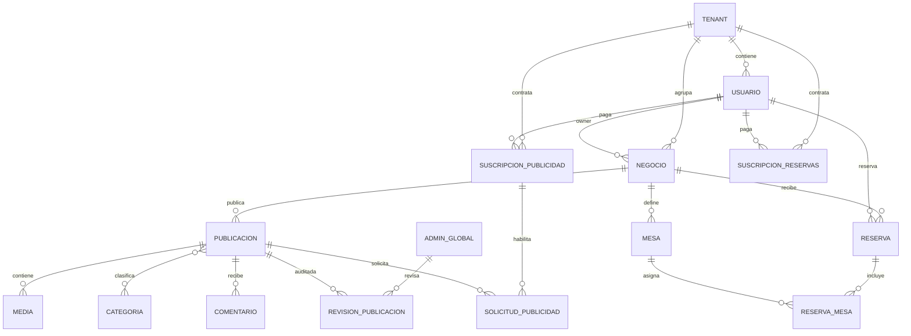

# Base de datos

## Resumen
La base de datos es PostgreSQL 15. El modelo es multi-tenant mediante `tenant_id` y politicas de Row Level Security (RLS). La estructura se inicializa con `db/init.sql`.

## Archivo de inicializacion
- `db/init.sql` crea enums, tablas, indices, triggers y politicas RLS.
- Incluye sentencias `DROP` al inicio, por lo que no es un script de migracion incremental.
- `db/db-init.sh` aplica el script solo cuando la base no existe.

## Multi-tenant con RLS
- Las politicas usan las variables de sesion `app.tenant_id` y `app.is_admin_global`.
- `runWithContext` en el backend setea estas variables por transaccion.
- El admin global puede operar sin `tenant_id`.

## Tablas principales
- `tenant`, `usuario`, `admin_global`.
- `negocio`, `publicacion`, `categoria`, `publicacion_categoria`.
- `media`, `comentario`, `revision_publicacion`.
- `mesa`, `reserva`, `reserva_mesa`.
- `suscripcion_publicidad`, `suscripcion_reservas`, `solicitud_publicidad`.
- `favorito`, `notificacion` (disponibles pero sin uso actual en API).

## Diagrama ER

## Triggers de consistencia
- `trg_negocio_tenant_consistency`: asegura que el negocio pertenezca al tenant del owner.
- `trg_publicacion_tenant_consistency`: asegura que publicacion, negocio y autor compartan tenant.

## Indices y restricciones relevantes
- Indices por `tenant_id`, `negocio_id`, `publicacion_id` y fechas de reserva.
- Unique index para calificaciones por usuario y publicacion.
- Validacion de calificaciones entre 1 y 5.

## Consideraciones
- Para cambios de esquema se recomienda migraciones en lugar de re-ejecutar `init.sql`.
- La relacion N:M entre publicaciones y categorias se maneja con `publicacion_categoria`.
