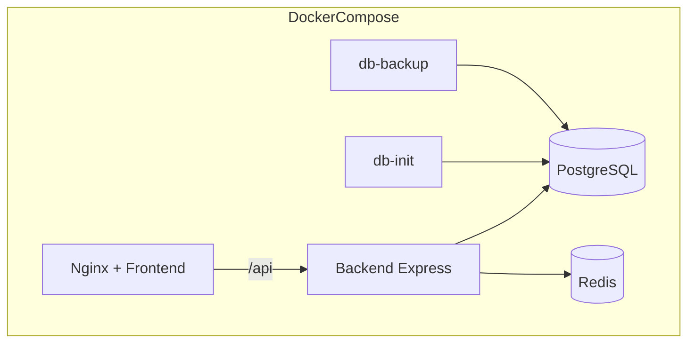
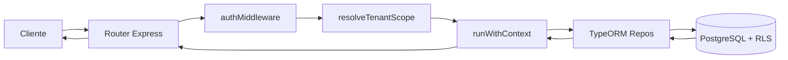
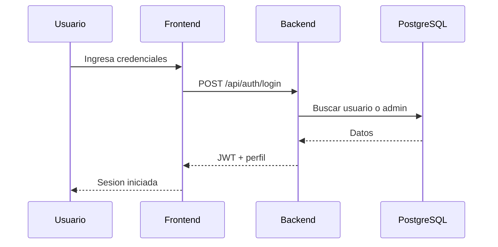
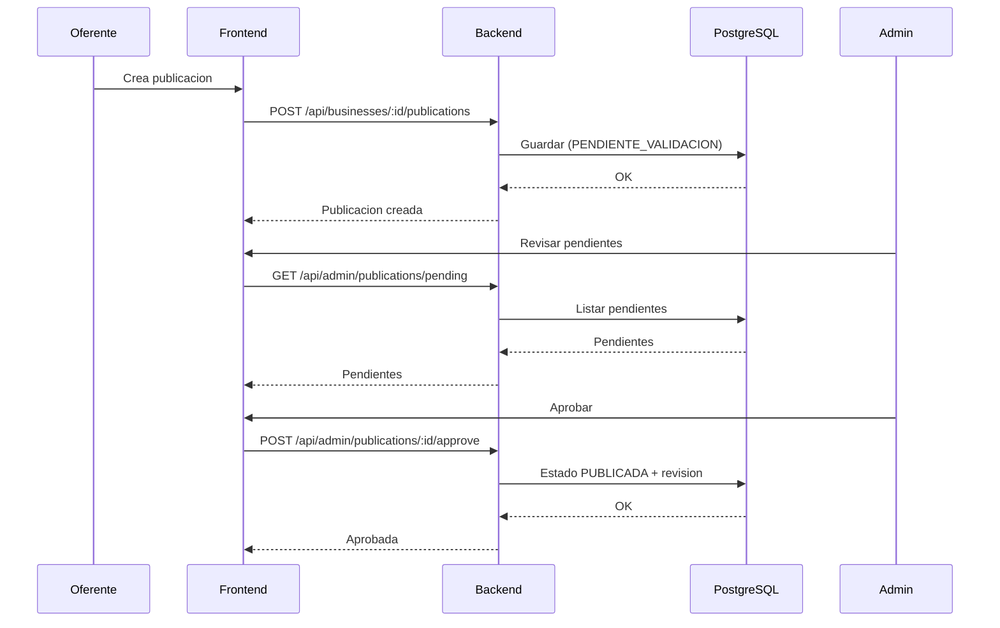
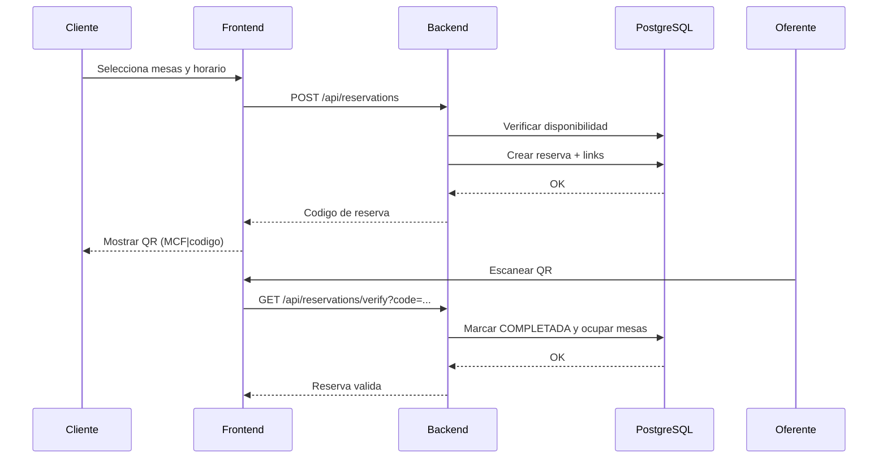

# Diagramas UML y de Arquitectura

## Sistema y despliegue

## Pipeline de peticion en backend

## Secuencia de login

## Secuencia de publicacion y moderacion

## Secuencia de reserva y validacion QR

