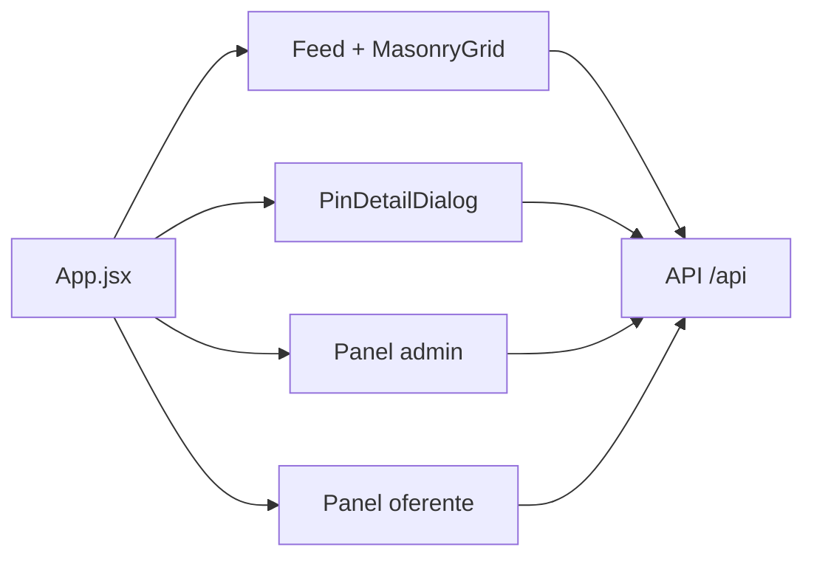

# Frontend

## Resumen
Aplicacion web en React 18 con Vite. La UI es una SPA con modales y paneles que consumen la API REST. Se utiliza Tailwind y Bootstrap para estilos, Leaflet para mapas y librerias de QR para reservas.

## Estructura relevante
- `frontend/src/main.jsx`: punto de entrada.
- `frontend/src/App.jsx`: estado global, fetch de datos y orquestacion de vistas.
- `frontend/src/components/`: componentes UI y dialogos.
- `frontend/src/components/ui/`: componentes base.
- `frontend/public/`: manifest, service worker y assetlinks.

## Componentes clave
- `Header`: navegación y acciones rapidas.
- `MasonryGrid`: layout del feed.
- `PinCard` y `PinDetailDialog`: tarjetas y detalle de publicaciones.
- `AdPanel`: panel de anuncios patrocinados.
- `BusinessMap` y `BusinessLocationPicker`: mapas y geocodificacion.
- `AuthDialog` y `ExploreDialog`: login, registro y exploracion.

## Estado y almacenamiento local
- `localStorage` guarda token y usuario (`token`, `user`, `tenantId`).
- Cache de feed y ads en `localStorage` para reducir requests.
- Likes y guardados del usuario se almacenan localmente.

## Flujos principales
- Autenticacion y persistencia de sesion.
- Feed publico, feed por tenant y filtros por categoria o negocio.
- Creacion y edicion de publicaciones por oferentes.
- Moderacion de publicaciones por admin global.
- Reservas de mesas con QR y validacion en el panel del negocio.
- Suscripciones de publicidad y planes de reservas.

## Mapas y geolocalizacion
- Leaflet muestra mapas con tiles de OpenStreetMap.
- Nominatim se usa para geocodificar direcciones.
- OSRM se usa para calcular rutas y distancias.

## PWA y offline
- `manifest.webmanifest` define instalacion como PWA.
- `sw.js` cachea imagenes y el feed publico.
- `assetlinks.json` habilita TWA en Android.

## Variables de entorno
- `VITE_API_URL`: base URL de la API.
- `VITE_API_PROXY_TARGET`: proxy en desarrollo local.
- `VITE_USE_HTTPS`, `VITE_HTTPS_KEY`, `VITE_HTTPS_CERT`: HTTPS local.
- `VITE_MP_PLAN_*_CHECKOUT_URL`: URLs de checkout Mercado Pago.
- `VITE_MP_PLAN_*_SUCCESS_PATH`: rutas de retorno tras pago.
- `VITE_MP_RESERVAS_CHECKOUT_URL`, `VITE_MP_RESERVAS_SUCCESS_PATH`.

## Diagrama de flujo UI

